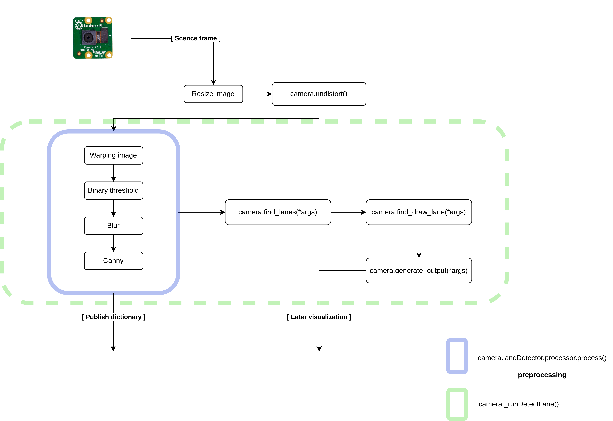

# BFMC - Brain ROS Project

## Module Structure 
```bash
├── perception 
│   ├── lane_detection 
│      	├── calibrate_imgs 
|			├──*.jpeg 
│   	├── core 
|			├── save 
|				├── .pkl 
|			├── __init__.py 
|			├── camera.py 
|			├── laneDetection.py 
|			├── main.py 
|			├── utils.py 
|   ├── detection
|  		├── edgetpumodel 
|           ├── __init__.py
|           ├── edgetpumodel.py
|           ├── nms.py
|           ├── utils.py        
|  		├── weights 
|           ├── traffic.tflite 
|  		├── data.yaml 
|  		├── detect.py
|  		├── DetectionProcess.py
|  		├── DetectionThread.py
│	├── CMakeLists.txt \
│   ├──	package.xml  \
│   ├──	perceptionNODE.py \
```

### Lane Detection Module
First, please examine the class diagram to understand information about some classes and relationships.


The following figure will briefly describe the flow of processing frame taken from the camera
in order to generate some intermediate results and generate the final output of lane detection



### Object Detection Module

### LOG
I don't remember whether that I changed the path in /perception/lanedetection/utils.py or not. If you have any problems with
paths, please revist that file and resolve :)) Thanks a lot !


